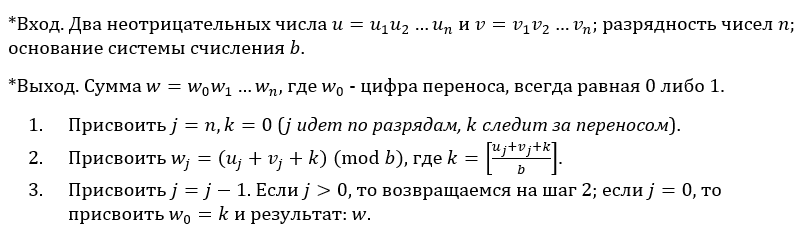
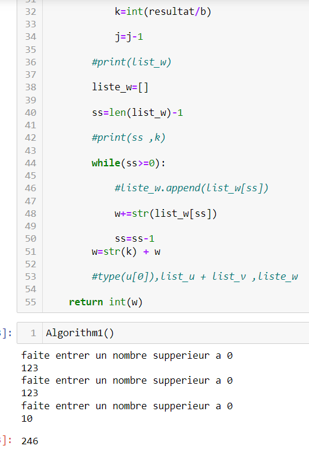
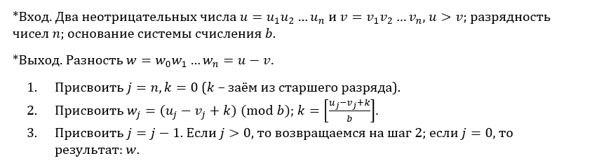
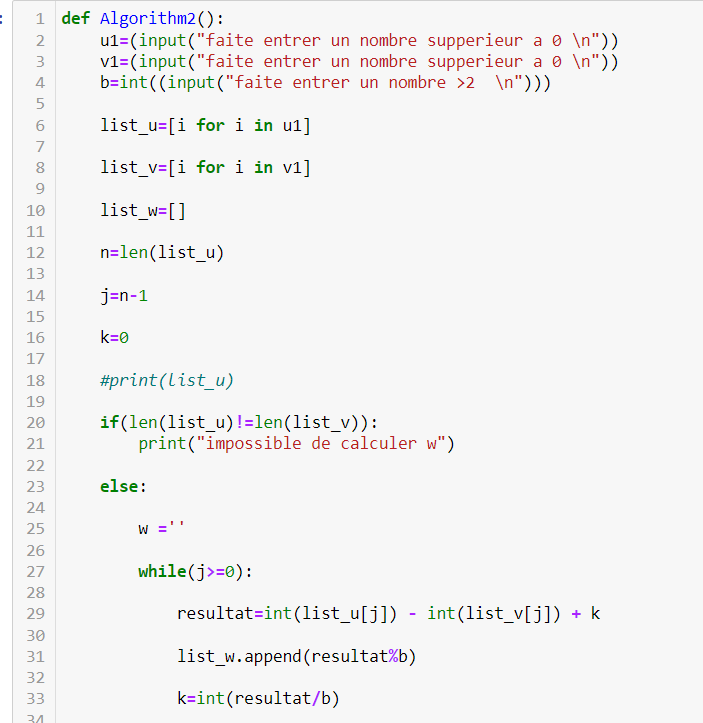
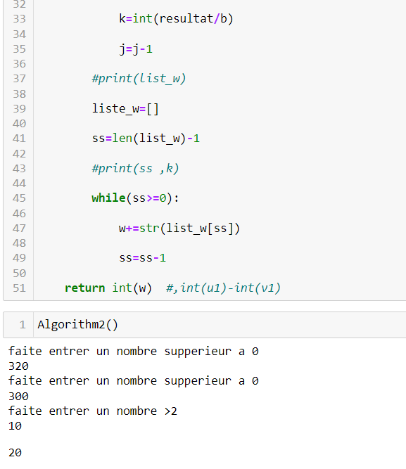
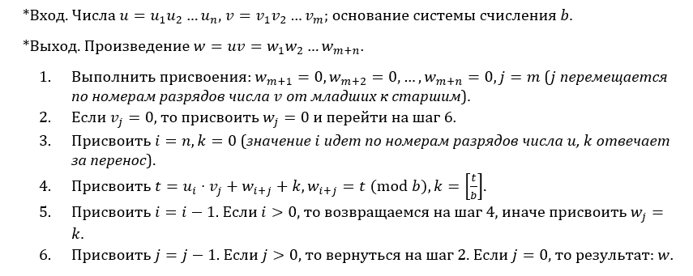
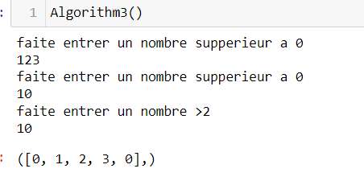
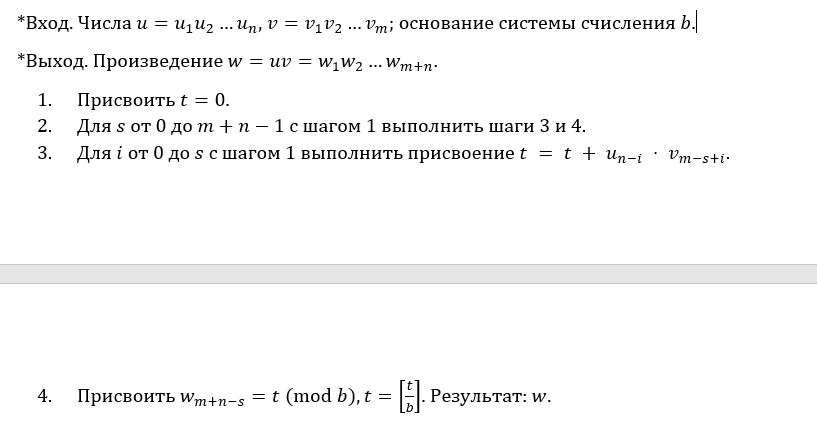
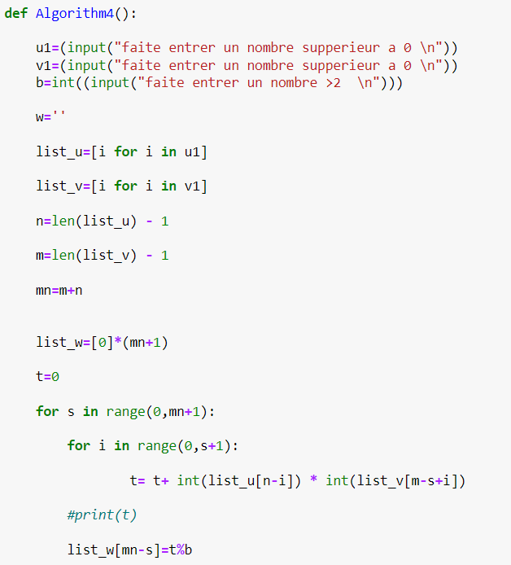
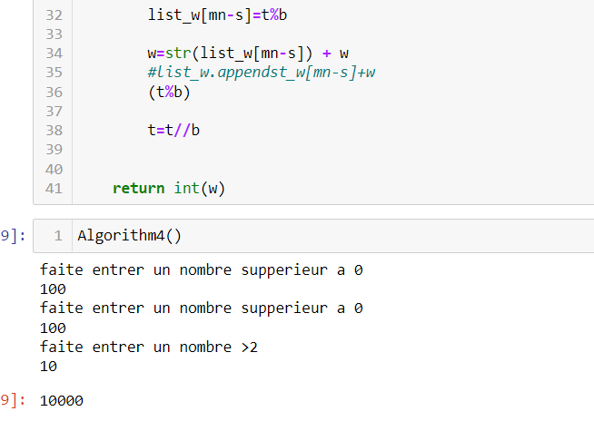

## РОССИЙСКИЙ УНИВЕРСИТЕТ ДРУЖБЫ НАРОДОВ

### Факультет физико-математических и естественных наук

### Кафедра прикладной информатики и теории вероятностей

#### Презентация  ПО

#### ЛАБОРАТОРНОЙ РАБОТЕ №8

***дисциплина: Математические основы защиты информации и информационной безопасности***

Студент: Хиссен Али Уэддей\
Группа: НПМмд-02-20\
Ст. билет № 1032209306

# Цель работы

Исследование алгоритмов работы с большими целыми числами.

# выполнение алгоритмрв 

**1 Сложение неотрицательных целых чисел**

**2 Вычитание неотрицательных целых чисел**

**3 Умножение неотрицательных целых чисел столбиком**

**4 Быстрый столбик**

**5 Деление многоразрядных целых чисел**

# Вывод
так мы изучили исследование алгоритмов работы с большими целыми, познакомились с вычислительными алгоритмами.
