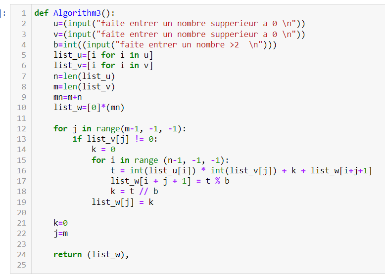

## РОССИЙСКИЙ УНИВЕРСИТЕТ ДРУЖБЫ НАРОДОВ

### Факультет физико-математических и естественных наук

### Кафедра прикладной информатики и теории вероятностей

#### ОТЧЕТ ПО

#### ЛАБОРАТОРНОЙ РАБОТЕ №8

***дисциплина: Математические основы защиты информации и информационной безопасности***

Студент: Хиссен Али Уэддей\
Группа: НПМмд-02-20\
Ст. билет № 1032209306

## Цель работы

Исследование алгоритмов работы с большими целыми числами.

# 1 Теоретические часть

**1.1 Сложение неотрицательных целых чисел**

**1.2 Вычитание неотрицательных целых чисел**

**1.3 Умножение неотрицательных целых чисел столбиком**

**1.4 Быстрый столбик**

**1.5 Деление многоразрядных целых чисел**

# 2 програмная часть 

**2.1 Сложение неотрицательных целых чисел**

**2.2 Вычитание неотрицательных целых чисел**

**2.3 Умножение неотрицательных целых чисел столбиком**

**1.4 Быстрый столбик**

**1.5 Деление многоразрядных целых чисел**

# Вывод
так мы изучили исследование алгоритмов работы с большими целыми, познакомились с вычислительными алгоритмами.